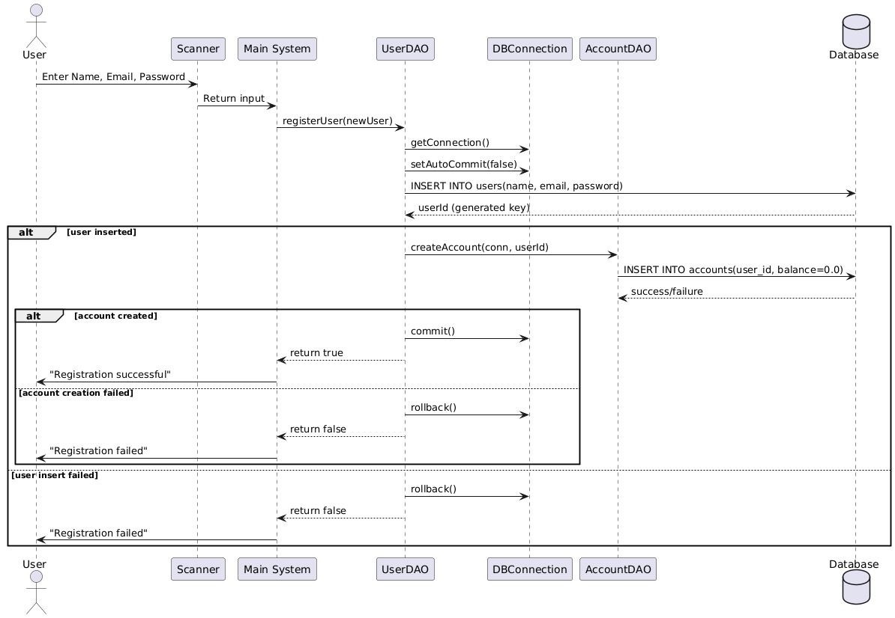

# mini-banking-system

1. Project Title & Introduction - 
Mini Banking System – A simple console-based banking application built with Java and MySQL. It supports user registration, login, deposits, withdrawals, transfers, transaction history filtering, password change, and soft account deletion.

2. Features -

    User Registration & Login (with BCrypt password hashing)
    
    Deposit & Withdraw money
    
    Transfer between accounts
    
    View Transaction History (with filters for date & type)
    
    Change Password (secure check with BCrypt)
    
    Soft Delete Account (user + account marked as deleted)
    
    Session management for logged-in users

3. Project Flow Explanation -

    a. Registration Flow:
  		  Here’s the UML diagram :
   
   
   
   	
          User enters name, email, password.
          System → calls UserDAO.registerUser(newUser).
          UserDAO → establishes DB connection, starts transaction.
          Insert into users table.
          On success, create account with balance = 0.
          Commit if successful, rollback if failure.
          Return status to user.
          Outcome: Account created, user registered.
      
    b. Login Flow:

        User enters email + password.
        System → calls UserDAO.login(email, password).
        DAO fetches user details, verifies password with BCrypt.
        If correct → Session.login(user) (store user in session).
        Else → show "Invalid credentials".

   c. View Profile Info Flow:

        System fetches current user from Session.getCurrentUser().
        Display user details (name, email, balance).

   d. Deposit Money Flow:

        User enters amount.
        System → calls TransactionDAO.deposit(userId, amount).
        DAO inserts new transaction (type = credit).
        Updates account balance.
        Return success/failure.

   e. Withdraw Money Flow:

   		User enters amount.
		Check if balance ≥ amount.
		If yes → create debit transaction, update balance.
		Else → show "Insufficient funds".
   
       

