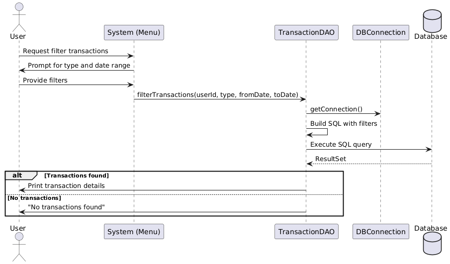

# mini-banking-system

1. Project Title & Introduction - 
Mini Banking System – A simple console-based banking application built with Java and MySQL. It supports user registration, login, deposits, withdrawals, transfers, transaction history filtering, password change, and soft account deletion.

2. Features -

    User Registration & Login (with BCrypt password hashing)
    
    Deposit & Withdraw money
    
    Transfer between accounts
    
    View Transaction History (with filters for date & type)
    
    Change Password (secure check with BCrypt)
    
    Soft Delete Account (user + account marked as deleted)
    
    Session management for logged-in users

3. Project Flow Explanation -

    a. Registration Flow:
   
  	Here’s the UML diagram :
   
   
   
   	
          User enters name, email, password.
          System → calls UserDAO.registerUser(newUser).
          UserDAO → establishes DB connection, starts transaction.
          Insert into users table.
          On success, create account with balance = 0.
          Commit if successful, rollback if failure.
          Return status to user.
          Outcome: Account created, user registered.
      
    b. Login Flow:

   	Here’s the UML diagram :
   
    
   
        User enters email + password.
        System → calls UserDAO.login(email, password).
        DAO fetches user details, verifies password with BCrypt.
        If correct → Session.login(user) (store user in session).
        Else → show "Invalid credentials".

   c. View Profile Info Flow:

   Here’s the UML diagram :
   
   

        System fetches current user from Session.getCurrentUser().
        Display user details (name, email, balance).

   d. Deposit Money Flow:

   Here’s the UML diagram :
   
   

        User enters amount.
        System → calls TransactionDAO.deposit(userId, amount).
        DAO inserts new transaction (type = credit).
        Updates account balance.
        Return success/failure.

   e. Withdraw Money Flow:

   Here’s the UML diagram :
   
   

   		User enters amount.
		Check if balance ≥ amount.
		If yes → create debit transaction, update balance.
		Else → show "Insufficient funds".

   f. Transfer Money Flow :

	Here’s the UML diagram :
   
   
   
   		User enters receiver account ID + amount.
		Check sender balance ≥ amount.
		If valid → create transaction (type = transfer).		
		Debit sender account.		
		Credit receiver account.		
		Update both balances inside DB transaction (commit/rollback).

	g. View Transaction History Flow:

	Here’s the UML diagram :
   
   

		User selects this option.
		DAO fetches all transactions related to user’s account.
		Display in console: ID, type, amount, date.

	h. Change Password Flow:

	Here’s the UML diagram :
   
   

		User enters current password + new password.
		DAO fetches stored password hash.
		Verify with BCrypt.checkpw().		
		If match → hash new password + update DB.		
		Return success/failure.

   i. Delete My Account (Soft Delete) Flow:

   	Here’s the UML diagram :
   
   

   		User confirms delete.
		DAO updates is_deleted = true in users and accounts tables.
		Session.logout() clears user session.

	j. Filter Transactions Flow :

	Here’s the UML diagram :
   
   

		User enters filters (type, date range).
		DAO builds SQL dynamically (WHERE conditions).
		Fetch + display matching transactions.

	k.  Logout Flow:

	Here’s the UML diagram :
   
   

		User selects "Logout".
		System calls Session.logout().
		Inside Session.logout() → currentUser = null.
		Console prints "Logged out successfully."

4. Database ER Diagram

	The following ER diagram represents the relationships between Users, Accounts, and Transactions in the system:

 	

		Users → Stores user details and credentials.
		Account → Each user has an account with balance information.
		Transaction → Tracks deposits, withdrawals, and transfers between accounts.

